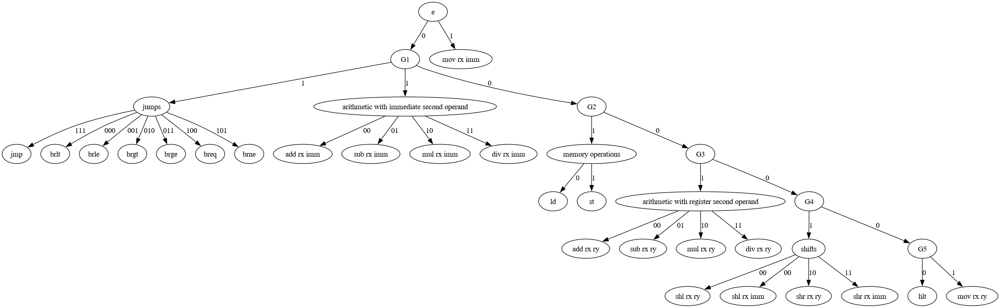

# BLRISC (a Bit Less Reduced Instruction Set Computer)

## General specifications
8 16-bit registers: r0-r7.

Minimal (and the only one, really) addressable unit is machine word (register size).

## Instruction set

All instructions are 2 bytes long.

### Register encoding

Straightforward: `r0`-`r7` is `000`-`111` respectively.

### Instructions

| Instruction     | Semantics                   | Encoding (`/` shows byte boundary, lowercase letters are binary, uppercase are hex)
| ------------    | ----------------------      | -----------------------------------
| `hlt`           | stop program execution      | 00      /00
| `mov rx ry`     | `rx = ry`                   | 0000001x/xxyyy000
| `mov rx imm`    | `rx = imm`                  | 1xxxiiii/II
| `shl rx ry`     | `rx <<= ry`                 | 00000100/xxxyyy00
| `shl rx imm`    | `rx <<= imm`                | 00000101/xxxiiii0
| `shr rx ry`     | `rx >>= ry`                 | 00000110/xxxyyy00
| `shr rx imm`    | `rx >>= imm`                | 00000111/xxxiiii0
| `add rx ry`     | `rx += ry`                  | 0000100x/xxyyy000
| `add rx imm`    | `rx += imm`                 | 00100xxx/II
| `sub rx ry`     | `rx -= ry`                  | 0000101x/xxyyy000
| `sub rx imm`    | `rx -= imm`                 | 00101xxx/II
| `mul rx ry`     | `rx *= ry`                  | 0000110x/xxyyy000
| `mul rx imm`    | `rx *= imm`                 | 00110xxx/II
| `div rx ry`     | `rx /= ry`                  | 0000111x/xxyyy000
| `div rx imm`    | `rx /= imm`                 | 00111xxx/II
| `ld rd [rs+rx]` | `rd = mem[rs+ri]`           | 00010ddd/sssxxx00
| `st [rd+rx] rs` | `mem[rs+ri] = rs`           | 00011ddd/sssxxx00
| `jmp off`       | `pc += off`                 | 01111iii/II
| `blt rx off`    | `if rx <  0 then pc += off` | 01000xxx/II
| `ble rx off`    | `if rx <= 0 then pc += off` | 01001xxx/II
| `bgt rx off`    | `if rx >  0 then pc += off` | 01010xxx/II
| `bge rx off`    | `if rx >= 0 then pc += off` | 01011xxx/II
| `beq rx off`    | `if rx == 0 then pc += off` | 01100xxx/II
| `bne rx off`    | `if rx != 0 then pc += off` | 01101xxx/II

